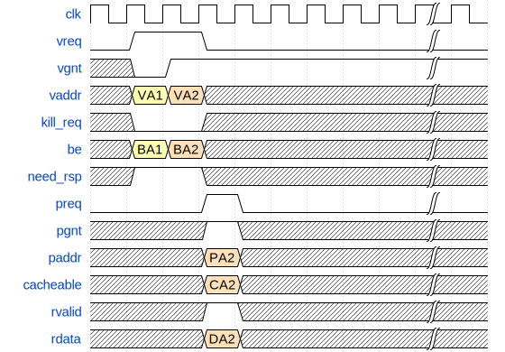
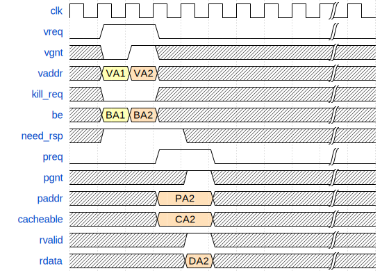
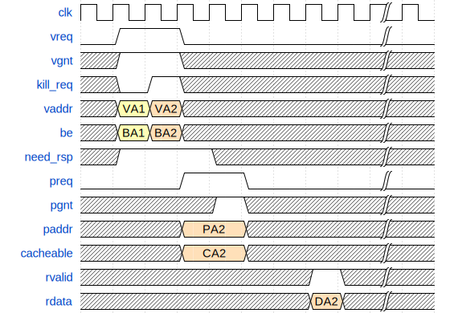
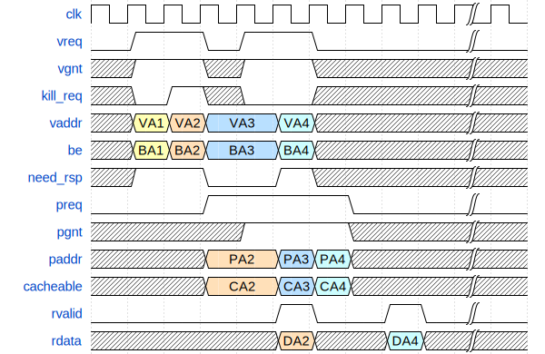
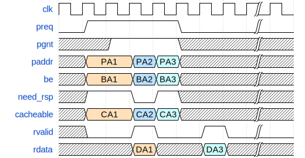

= YPB interface Specification 0.0.1
:toc:
:toclevels: 3
:doctype: book
:encoding: utf-8

[cols="2,6,2,2",options="header"]
|===
|Version |Change Description |Author |Date
|0.0.1 |Initial specification |Yannick Casamatta – Thales |2025-02-20
|===

[NOTE]
====
YPB stands for "Yet another Pipeline Bus", a unifying protocol designed to facilitate the management and integration of deeply configurable cores, such as CVA6, across multiple cache and memory architectures.
====

[NOTE]
====
This document is open source. Licensed under the Solderpad License, Version 2.0 (See “License Statement” on page <<license>>).
====

[preface]
== Introduction

The purpose of this specification is to define a simple interface for connecting
a CPU pipeline to memory, in order to support both an adapter towards a cache
and an adapter towards a transactional bus interface.

Although this standard is generic, it was initially developed for CVA6,
a RISC‑V CPU, with the goal of providing:

* An embedded core connected through an OBI (Open Bus Interface)
* An APU core connected to Virtually Indexed and Physically Tagged (VIPT) L1 caches

This specification therefore reuses, to a large extent, the definitions from:

* The "OBI" specification, version 1.6 by Arjan Bink, Silicon Labs
* The "Cache‑Requesters Interface" (CRI) described in the HPDcache User Guide Release v1.0.1 by César Fuguet

The goal is to use a single set of signals that can easily be mapped either to
an OBI-like transactional bus interface or to a CRI-like cache interface.

This document is the architecture specification for the YPB interface, designed
to be compatible with both OBI-style bus interfaces and HPDcache-style CRI
(cache requester) interfaces.

[[license]]
== License Statement

This document, all associated software, and derivatives thereof are licensed under the Solderpad License, Version 2.0 (the "License").

Use of this file means you agree to the terms and conditions of the License and are in full compliance with the License.

You may obtain a copy of the License at:

https://solderpad.org/licenses/SHL-2.0/

Unless required by applicable law or agreed to in writing, software and hardware implementations thereof distributed
under the License is distributed on an "AS IS" BASIS, WITHOUT WARRANTIES OR CONDITIONS OF ANY KIND,
EITHER EXPRESSED OR IMPLIED.

See the License for the specific language governing permissions and limitations under the License.

== 1. Scope

The YPB protocol defines a generic memory interface between a master
(e.g. CPU pipeline) and a memory subsystem (cache, RAM, bus adapter, etc.).

Key properties:

* Single unified signal set for all configurations.
* Multiple operation modes:
** *P2P‑VIPT*: Point‑to‑Point, virtual address phase + physical address phase + response.
** *P2P‑PhysOnly*: Point‑to‑Point, physical address phase + response (no virtual phase).
** *BUS*: Connected through an adapter to a transactional bus (e.g. OBI-like).
* Optional support for:
** Atomic operations (AMO),
** Multiple outstanding transactions (via `aid`/`rid`),
** Cacheable / non-cacheable attributes,
** Request abort (`kill_req`) in P2P modes,
** Requests that may not require a data response (`need_rsp`).

This specification defines:

. Interface signals.
. Transaction phases.
. Handshake rules.
. Operation modes and timing differences.
. Example transactions.
. Minimal profile constraints.

== 2. YPB Interface Types

=== 2.1 Request Structure `YPB_REQ_T(cfg, DATA_WIDTH)`

[source,systemverilog]
----
`define YPB_REQ_T(cfg, DATA_WIDTH) \
  struct packed {
    logic                             vreq;
    logic                             preq;
    logic [VLEN-1:0]                  vaddr;
    logic [PLEN-1:0]                  paddr;
    logic [DATA_WIDTH/8-1:0]          be;
    logic [1:0]                       size;
    logic                             we;
    logic [DATA_WIDTH-1:0]            wdata;
    logic [DATA_USER_WIDTH-1:0]       wuser;
    logic [ID_WIDTH-1:0]              aid;
    logic [AMO_WIDTH-1:0]             atop;
    logic                             access_type;
    logic                             cacheable;
    logic                             kill_req;
    logic                             need_rsp;
    logic                             rready;
  }
----

=== 2.2 Response Structure `YPB_RSP_T(cfg, DATA_WIDTH)`

[source,systemverilog]
----
`define YPB_RSP_T(cfg, DATA_WIDTH) \
  struct packed {
    logic                             vgnt;
    logic                             pgnt;
    logic                             rvalid;
    logic [DATA_WIDTH-1:0]            rdata;
    logic [DATA_USER_WIDTH-1:0]       ruser;
    logic [ID_WIDTH-1:0]              rid;
    logic                             err;
  }
----

== 3. Signal Definitions

=== 3.1 Request signals (`YPB_REQ_T`)

[cols="1,1,4",options="header"]
|===
|Signal
|Dir. (M→S)
|Normative meaning

|`vreq`
|M→S
|Virtual request valid. Used only in *P2P‑VIPT* mode (virtual address phase).

|`preq`
|M→S
|Physical request valid. Used in all modes.

|`vaddr`
|M→S
|Virtual address. Used when `vreq = 1` (P2P‑VIPT) to index VIPT caches.

|`paddr`
|M→S
|Physical address. Used when `preq = 1`.

|`be`
|M→S
|Byte enable (little-endian), one bit per byte of `wdata`/`rdata`.

|`size`
|M→S
|Access size, encoded as power-of-two (`0`→1B, `1`→2B, `2`→4B, `3`→8B). Optional; if present, it shall be set according to `be`.

|`we`
|M→S
|Write enable: `0` = read access, `1` = write access.

|`wdata`
|M→S
|Write data when `we = 1`. For read-only ports (no write), `wdata` shall be tied to `'0`.

|`wuser`
|M→S
|Write user data when `we = 1`. If not used, shall be tied to `'0`.

|`aid`
|M→S
|Request ID. Used to match responses (`rid`) to requests when multiple transactions are in flight.

|`atop`
|M→S
|Atomic operation type (AMO). Semantics aligned with the RISC-V "A" extension. The `atop` signal is optional. If not used, it shall be tied off to `AMO_NONE`.

|`access_type`
|M→S
|Access type attribute (e.g. instruction vs data, privilege/protection bit). Target-dependent interpretation.

|`cacheable`
|M→S
|`1` = access is cacheable; `0` = non-cacheable / I/O / bypass, depending on target definition.

|`kill_req`
|M→S
|Request abort/kill. Valid only in P2P modes (not arbitrable in bus style address/response protocols).

|`need_rsp`
|M→S
|Indicates whether a data phase (response) is required. In P2P modes this may be `0` to indicate no data response is needed (e.g. fire‑and‑forget writes), but the memory access itself shall still be performed.

|`rready`
|M→S
|Indicates that the master is ready to accept a response (`rvalid`).
|===

Configuration rules and options:

* If no AMO is supported: `atop` shall be fixed to a neutral value (e.g. `AMO_NONE`).
* If no *write* is ever issued on this port:
** `we` shall be fixed to `0`,
** `wdata` may be tied to `'0` (ignored by the slave),
* If no *read* is ever issued on this port:
** `we` shall be fixed to `1`,
** `rdata` shall be fixed to `'0` by the slave (no useful read data),
** Write completion and/or errors may still be signaled with `rvalid`/`err`.
* If the interface is not used in VIPT mode:
** `vreq = 0`, `vaddr` is don’t-care, `vgnt` may be ignored by the master.
* If the master is always ready to accept responses:
** `rready` may be tied to `1'b1`.
* If only a single outstanding transaction is supported:
** `aid` and `rid` shall be constant zero.
* If the master never wants to suppress responses:
** `need_rsp` may be tied to `1'b1`.

=== 3.2 Response signals (`YPB_RSP_T`)

[cols="1,1,4",options="header"]
|===
|Signal
|Dir. (S→M)
|Normative meaning

|`vgnt`
|S→M
|Grant for the virtual phase (`vreq`). Indicates acceptance of the virtual address phase (P2P‑VIPT only).

|`pgnt`
|S→M
|Grant for the physical phase (`preq`). Indicates acceptance of the physical address/command phase.

|`rvalid`
|S→M
|Response valid. Indicates that `rdata`, `rid`, and `err` are valid for transactions that require a response.

|`rdata`
|S→M
|Response data, valid when `rvalid = 1`. For write-only ports (no reads), `rdata` shall be tied to `'0`.

|`ruser`
|S→M
|Response user data, valid when `rvalid = 1`. If not used, shall be tied to `'0`.

|`rid`
|S→M
|Response ID. Must match the `aid` of the corresponding request when multiple outstanding transactions are allowed.

|`err`
|S→M
|Error indication for the request (bus error, protection violation, etc.).
|===

== 4. Transaction Phases and Attribute Timing

YPB defines up to three logical phases:

* VIRTUAL address phase (P2P‑VIPT only),
* PHYSICAL address phase,
* RESPONSE data phase.

All phases are synchronous to a common clock.

=== 4.1 Attribute placement rules

* Address‑related attributes (`be`, `size`, `aid`) are associated with the **first accepted address phase** of the transaction:
** In *P2P‑VIPT*: they shall be driven and valid on the cycle where `vreq & vgnt = 1`.
** In *P2P‑PhysOnly* and *BUS*: they shall be driven and valid on the cycle where `preq & pgnt = 1`.
* Data‑ and access‑type attributes (`wdata`, `cacheable`, `access_type`, plus `we` and `atop`) are associated with the **physical phase**:
** In all modes, they shall be driven and valid on the cycle where `preq & pgnt = 1`.

TO BE DEFINE: this ensures compatibility with CRI of HPdcache, there is probably no need to have `be`, `size` at the initial request in *P2P‑VIPT* mode. 

=== 4.2 Virtual Phase

Used only in *P2P‑VIPT* mode.

Purpose: allow the master to send a virtual address early so a VIPT cache can start indexing while the MMU performs address translation.

The Virtual phase does not constitute a transaction.
Only the Physical phase creates a committed transaction.

Signals: `vreq`, `vaddr`, `vgnt`, and  `be`, `size`, `aid` as first‑phase attributes.

Acceptance rule:

* At cycle N, if `vreq = 1` and `vgnt = 1`, the virtual phase of the request is accepted.
* The master shall keep `vaddr`, `be`, `size`, and `aid` stable while `vreq = 1` and until the cycle where `vreq & vgnt = 1`.

=== 4.3 Physical Phase

Used in all modes (P2P‑VIPT, P2P‑PhysOnly, BUS).

Purpose: carry the physical address and all data/policy attributes.

The Physical phase constitute a transaction that need to be completed.

Signals:

* In all modes: `preq`, `paddr`, `we`, `wdata`, `atop`, `access_type`, `cacheable`, `need_rsp`.
* In P2P‑PhysOnly and BUS modes (where there is no prior virtual phase): `be`, `size`, and `aid` are also driven and sampled here as the *first* address phase.

Acceptance rule:

* At cycle M, if `preq = 1` and `pgnt = 1`, the physical phase of the request is accepted.
* The master shall keep `paddr` and all physical‑phase attributes (`we`, `wdata`, `wuser`, `atop`, `access_type`, `cacheable`, `need_rsp`, and in P2P‑PhysOnly/BUS also `be`, `size`, `aid`) stable while `preq = 1` and until `preq & pgnt = 1`.

=== 4.4 Response Phase

Purpose: carry read data and/or completion status and error information.

Signals: `rvalid`, `rdata`, `ruser`, `rid`, `err`, `rready`.

Consumption rule:

* At cycle K, if `rvalid = 1` and `rready = 1`, the response is consumed by the master.
* The master shall sample `rdata`, `rid`, and `err` in that cycle.

`need_rsp` interaction:

* For transactions with `need_rsp = 1`:
** The slave shall eventually assert `rvalid = 1` with the corresponding `rid` and error status (and data for reads).
* For transactions with `need_rsp = 0`:
** In P2P modes, the slave is allowed to *omit* the data phase: it may never assert `rvalid` for this transaction, provided the memory access is still effectively performed.
** In BUS mode, behavior is bus‑ and adapter‑dependent; a completion/ack phase may still be needed by the external bus protocol.

=== 4. Outstanding Model

The protocol supports multiple outstanding transactions,
but only after Physical commit.

.Virtual Phase
* Cannot be outstanding

.Physical Phase
* May be outstanding until response

.Response Phase
* May return out-of-order if implementation allows, in that case usage of aid/rid is mandatory

== 5. Operation Modes

The protocol behavior is refined by the selected mode:

* *P2P‑VIPT*: virtual phase + physical phase + response; physical and response phases may be merged.
* *P2P‑PhysOnly*: physical phase + response; no virtual phase and no phase merge (to avoid combinational loops).
* *BUS*: mapped to a bus (e.g. OBI‑like); address and response phases strictly time‑separated.

=== 5.1 Mode P2P‑VIPT

==== 5.1.1 Overview

This mode is used in point‑to‑point connections between a master and a VIPT cache with MMU.

Phases:

. Virtual address phase (with early attributes: `be`, `size`, `aid`).
. Physical address phase (with `paddr`, `we`, `wuser`, `wdata`, `atop`, `access_type`, `cacheable`, `need_rsp`).
. Response phase.

The physical and response phases may be merged (same cycle) in this mode.

==== 5.1.2 Timing rules

Virtual phase:

* Cycle N:
** Master asserts `vreq = 1`, `vaddr = virtual_address`.
** Master also drives `be`, `size`, and `aid` (first address phase attributes).
** Slave asserts `vgnt = 1` when it accepts the virtual phase.
* The virtual phase is accepted at cycle N if `vreq & vgnt = 1`.
* The master shall keep `vaddr`, `be`, `size`, and `aid` stable until the accept cycle.

Physical phase:

* If translation completes successfully:
** At cycle N+1 (immediately following an accepted virtual phase at cycle N), the master shall provide:
*** `preq = 1`,
*** `paddr = corresponding physical address`,
*** `we`, `wdata`, `wuser`, `atop`, `access_type`, `cacheable`, `need_rsp` (physical‑phase attributes).
* If translation is not ready at cycle N+1:
** The master shall abort the request by asserting `kill_req = 1`.
** The master shall not issue a valid `preq/paddr` for this virtual phase.
** The master can resent a new Virtual phase, `vreq = 1`, `vaddr = virtual_address`. vaddr can be updated.
* The slave accepts the physical phase when `preq & pgnt = 1`.

Response phase:

* For requests with `need_rsp = 1`:
** The slave asserts `rvalid = 1`, with `rdata`, `ruser`, `rid`, and `err` valid.
** `rid` must match the `aid` captured at the virtual phase.
* For requests with `need_rsp = 0`:
** The slave may omit the response completely (no `rvalid` for this transaction), as long as the memory access is executed and side effects are applied.

* The master asserts `rready = 1` when it can accept responses.
* A response is consumed when `rvalid & rready = 1`.

==== 5.1.3 Phase merging (physical + response)

In *P2P‑VIPT*, it is allowed that for a given request:

* At cycle M, where the physical phase is accepted (`preq & pgnt = 1`), the slave also asserts `rvalid = 1` (if `need_rsp = 1`).

Example:

----
Cycle M:
  preq   = 1
  pgnt   = 1
  rvalid = 1
----

This represents a minimal‑latency access (e.g. combinational cache hit or single‑cycle SRAM path).

==== 5.1.4 `kill_req` semantics in P2P‑VIPT

* `kill_req` is used to abort a request whose virtual phase has been accepted but for which the physical phase cannot be provided at the required time (cycle N+1).
* When `kill_req = 1` for a request:
** The slave shall not perform the corresponding memory access.
** The slave may internally mark the request as aborted.
** The master shall not expect a normal response for this request, or shall ignore any such response if generated.
** Prevents any transaction from being created, Must not allocate permanent resources

=== 5.2 Mode P2P‑PhysOnly

==== 5.2.1 Overview

This mode is used in point‑to‑point connections when the virtual phase is not used
(no VIPT usage for this port, or no MMU dependency).

Phases:

* Physical address phase (first address phase, includes `be`, `size`, `aid`).
* Response phase.

Important constraint:

* In *P2P‑PhysOnly*, no merging of physical phase and response phase is allowed,
  in order to avoid combinational path loops 

==== 5.2.2 Timing rules

Physical phase:

* At cycle M:
** Master asserts:
*** `preq = 1`,
*** `paddr = physical_address`,
*** `be`, `size`, `aid` (first address phase attributes),
*** `we`, `wdata`, `atop`, `access_type`, `cacheable`, `need_rsp`.
** Slave asserts `pgnt = 1` when it accepts the physical request.
* The physical phase is accepted at cycle M if `preq & pgnt = 1`.

Response phase (no merge):

* For requests with `need_rsp = 1`:
** The earliest cycle where `rvalid` may be asserted for this transaction is *M+1*.
* A new request can occured when `rvalid = 1 && rready = 1`.

on the same cycle in P2P‑PhysOnly mode.

* For requests with `need_rsp = 0`:
** The slave must never assert `rvalid` for this transaction, as long as the memory access is executed. `rready` is not checked in that transaction.

* The usual handshake applies:
** `rvalid = 1` indicates a valid response,
** `rready` controls consumption.

Unused or optional signals:

* `vreq`, `vaddr` are not used; the master shall drive `vreq = 0`.
* `vgnt` can be ignored or tied to a constant.
* `kill_req`:
** may be implemented to abort in‑flight requests (if supported by the slave),
** or may be tied to `0` and ignored.

=== 5.3 Mode BUS

==== 5.3.1 Overview

This mode is used when YPB is connected via an adapter to an external transaction bus (e.g. OBI‑like, AHB‑like).

Phases:

* Bus address/command phase (mapped from YPB physical phase),
* Bus response phase (mapped to YPB response phase).

Characteristics:

* Virtual phase is not used.
* `kill_req` cannot be used to cancel a transaction once the bus address phase has been accepted.
* Address and response phases are strictly time‑separated.

==== 5.3.2 Address (physical) phase

YPB → bus mapping example (OBI‑like):

* `preq` ↔ `req`
* `paddr` ↔ `addr`
* `we` ↔ `we`
* `be` ↔ `be`
* `wdata` ↔ `wdata`
* `wuser` ↔ `wuser`
* `aid` ↔ `aid`
* `atop` ↔ `atop`
* `access_type` ↔ `prot` bits
* `cacheable` ↔ `memtype` bits
* `need_rsp` ↔ bus "no‑response" or "posted write" indication (if supported by the bus protocol; otherwise the adapter shall emulate required behavior).

`pgnt` ↔ bus `gnt`.

Acceptance rule:

* At cycle N, if `preq & pgnt = 1`, the bus address/command phase for this transaction is accepted.
* `be`, `size`, `aid` must be valid in that cycle (first address phase attributes).

==== 5.3.3 Response phase

* `rvalid`, `rdata`, `ruser`, `rid`, `err`, `rready` are mapped to bus response signals
  (e.g. OBI `rvalid`, `rdata`,`ruser`, `rid`, `err`, `rready`).
* For `need_rsp = 0`:
** Whether a bus response is still required depends on the bus protocol.
** The adapter may still generate a completion response on YPB, or may suppress it, according to system requirements.

==== 5.3.4 Timing constraint: no same‑cycle response

For a given transaction in BUS mode:

* If the address phase is accepted at cycle N (`preq & pgnt = 1`),
* the first cycle where `rvalid = 1` for that transaction must be *N+1 or later*.

==== 5.3.5 Specific signals

* `vreq` must be `0`; `vaddr` is unused; `vgnt` may be tied to `1` or ignored.
* `kill_req` has no effect on a transaction once its address phase has been accepted on the bus.
  It may only be used internally (before issuing the bus request) by the adapter.

== 6. Example Transactions

=== 6.1 P2P‑VIPT: read with merged physical/response

. Cycle 0 – virtual phase
* Master:
** `vreq = 1`
** `vaddr = VA0`
** `be = 4'b1111`, `size = 2`, `aid = A0`
* Slave:
** `vgnt = 1`

→ Virtual phase accepted at cycle 0.

. Cycle 1 – physical + response merged
* Master (translation ready):
** `preq = 1`
** `paddr = PA0`
** `we = 0`
** `atop = AMO_NONE`
** `cacheable = 1`
** `access_type = 0`
** `need_rsp = 1`
* Slave:
** `pgnt = 1`
** `rvalid = 1`
** `rdata = DATA0`
** `rid = A0`
** `err = 0`
* Master:
** `rready = 1`

→ Physical phase accepted and response consumed at cycle 1.

=== 6.2 P2P‑VIPT: posted write (no response) using `need_rsp = 0`

. Cycle 0 – virtual phase
* `vreq = 1`, `vaddr = VA1`, `be`, `size`, `aid = A1`, `vgnt = 1`.

→ Virtual phase accepted.

. Cycle 1 – physical phase
* Master:
** `preq = 1`
** `paddr = PA1`
** `we = 1`
** `wdata = WD1`
** `cacheable = 0`
** `access_type = 0`
** `atop = AMO_NONE`
** `need_rsp = 0`
* Slave:
** `pgnt = 1`

→ Write is accepted and must be executed by the memory system.

* Slave:
** May *never* assert `rvalid` for `rid = A1`, since `need_rsp = 0`.

=== 6.3 P2P‑VIPT: translation not ready, using `kill_req`

. Cycle 0 – virtual phase
* `vreq = 1`, `vaddr = VA2`, `be`, `size`, `aid = A2`, `vgnt = 1`.

→ Virtual phase accepted.

. Cycle 1 – translation not ready
* MMU cannot yet produce `PA2`:
** Master:
*** `preq = 0`
*** `kill_req = 1`

→ Request associated with VA2 is aborted. No physical access is issued.

=== 6.4 P2P‑PhysOnly: simple read (no phase merge)

. Cycle 0 – physical phase
* Master:
** `preq = 1`
** `paddr = PA3`
** `be = 4'b1111`
** `size = 2`
** `aid = A3`
** `we = 0`
** `cacheable = 1`
** `access_type = 0`
** `atop = AMO_NONE`
** `need_rsp = 1`
* Slave:
** `pgnt = 1`

→ Physical request accepted at cycle 0.

. Cycle 1 – response
* Slave:
** `rvalid = 1`
** `rdata = DATA3`
** `rid = A3`
** `err = 0`
* Master:
** `rready = 1`

→ Response consumed at cycle 1.

Note: In P2P‑PhysOnly, there must not be a cycle where `preq & pgnt & rvalid` are all `1` for the same transaction.

=== 6.5 BUS mode: address + delayed response

. Cycle 0 – address phase
* Master:
** `preq = 1`
** `paddr = PA4`
** `be = 4'b1111`
** `size = 2`
** `aid = A4`
** `we = 0`
** `cacheable = 1`
** `access_type = 0`
** `atop = AMO_NONE`
** `need_rsp = 1`
* Slave/adapter:
** `pgnt = 1`

→ Bus address phase accepted at cycle 0.

. Cycle 1 – no response yet
* `rvalid = 0`.

. Cycle 2 – response
* Slave/adapter:
** `rvalid = 1`
** `rdata = DATA4`
** `rid = A4`
** `err = 0`
* Master:
** `rready = 1`

→ Response consumed at cycle 2. Address and response phases are strictly time‑separated.

=== 6.6 Diagram P2P‑VIPT mode (WaveDrom JSON)

[source,json]
----
{ "signal": [
  { "name": "clk",      "wave": "p........|." },
  { "name": "vreq",     "wave": "01.0.....|." },
  { "name": "vgnt",     "wave": "x01......|." },
  { "name": "vaddr",    "wave": "x34x.....|.", "data": ["VA1","VA2"] },
  { "name": "kill_req",     "wave": "x0.x.....|." },
  { "name": "be",       "wave": "x34x.....|.", "data": ["BA1","BA2"] },
  { "name": "need_rsp", "wave": "x1.x.....|.", "data": ["0"] },
  { "name": "preq",     "wave": "0..10....|." },
  { "name": "pgnt",     "wave": "x..1x....|." },
  { "name": "paddr",    "wave": "x.x4x....|.", "data": ["PA2"] },
  { "name": "cacheable",    "wave": "x.x4x....|.", "data": ["CA2"] },
  { "name": "rvalid",   "wave": "x..1x....|." },
  { "name": "rdata",    "wave": "x.x4x....|.", "data": ["DA2"] },
]}
----

[source,json]
----
{ "signal": [
  { "name": "clk",      "wave": "p........|." },
  { "name": "vreq",     "wave": "01.0.....|." },
  { "name": "vgnt",     "wave": "x01x.....|." },
  { "name": "vaddr",    "wave": "x34x.....|.", "data": ["VA1","VA2"] },
  { "name": "kill_req",     "wave": "x0.x.....|." },
  { "name": "be",       "wave": "x34x.....|.", "data": ["BA1","BA2"] },
  { "name": "need_rsp", "wave": "x1..x....|.", "data": ["0"] },
  { "name": "preq",     "wave": "0..1.0...|." },
  { "name": "pgnt",     "wave": "x...1x...|." },
  { "name": "paddr",    "wave": "x.x4.x...|.", "data": ["PA2"] },
  { "name": "cacheable",    "wave": "x.x4.x...|.", "data": ["CA2"] },
  { "name": "rvalid",   "wave": "x...1x...|." },
  { "name": "rdata",    "wave": "x..x4x...|.", "data": ["DA2"] },
]}
----

[source,json]
----
{ "signal": [
  { "name": "clk",      "wave": "p........|." },
  { "name": "vreq",     "wave": "01.0.....|." },
  { "name": "vgnt",     "wave": "x1.x.....|." },
  { "name": "kill_req",     "wave": "x01x.....|." },
  { "name": "vaddr",    "wave": "x34x.....|.", "data": ["VA1","VA2"] },
  { "name": "be",       "wave": "x34x.....|.", "data": ["BA1","BA2"] },
  { "name": "need_rsp", "wave": "x1..x....|.", "data": ["0"] },
  { "name": "preq",     "wave": "0..1.0...|." },
  { "name": "pgnt",     "wave": "x...1x...|." },
  { "name": "paddr",    "wave": "x.x4.x...|.", "data": ["PA2"] },
  { "name": "cacheable",    "wave": "x.x4.x...|.", "data": ["CA2"] },
  { "name": "rvalid",   "wave": "x......1x|." },
  { "name": "rdata",    "wave": "x..x...4x|.", "data": ["DA2"] },
]}
----

[source,json]
----
{ "signal": [
  { "name": "clk",      "wave": "p.......|." },
  { "name": "preq",     "wave": "01...0..|." },
  { "name": "pgnt",     "wave": "x.1..x..|." },
  { "name": "paddr",    "wave": "x4.56x..|.", "data": ["PA1", "PA2","PA3"] },
  { "name": "be",       "wave": "x4.56x..|.", "data": ["BA1","BA2","BA3"] },
  { "name": "need_rsp", "wave": "x1.01x..|.", "data": ["0"] },
  { "name": "cacheable",    "wave": "x4.56x..|.", "data": ["CA1","CA2","CA3"] },
  { "name": "rvalid",   "wave": "x0.10.10|." },
  { "name": "rdata",    "wave": "xx.4xx6x|.", "data": ["DA1", "DA3"] },
]}
----

=== 6.7 Diagram P2P‑PhysOnly mode (WaveDrom JSON)

image::img/diagramPhyOnly1.svg[alt="diagramPhyOnly1",width=600,align=center]

[source,json]
----
{ "signal": [
  { "name": "clk",      "wave": "p.......|." },
  { "name": "preq",     "wave": "01...0..|." },
  { "name": "pgnt",     "wave": "x.1..x..|." },
  { "name": "paddr",    "wave": "x4.56x..|.", "data": ["PA1", "PA2","PA3"] },
  { "name": "be",       "wave": "x4.56x..|.", "data": ["BA1","BA2","BA3"] },
  { "name": "need_rsp", "wave": "x1.01x..|.", "data": ["0"] },
  { "name": "cacheable",    "wave": "x4.56x..|.", "data": ["CA1","CA2","CA3"] },
  { "name": "rvalid",   "wave": "x0.10.10|." },
  { "name": "rdata",    "wave": "xx.4xx6x|.", "data": ["DA1", "DA3"] },
]}
----

=== 6.8 Diagram BUS mode (WaveDrom JSON)

[source,json]
----
{ "signal": [
  { "name": "clk",      "wave": "p........|." },
  { "name": "vreq",     "wave": "01.0.....|." },
  { "name": "vgnt",     "wave": "x01......|." },
  { "name": "vaddr",    "wave": "x34x.....|.", "data": ["VA1","VA2"] },
  { "name": "kill_req",     "wave": "x0.x.....|." },
  { "name": "be",       "wave": "x34x.....|.", "data": ["BA1","BA2"] },
  { "name": "need_rsp", "wave": "x1.x.....|.", "data": ["0"] },
  { "name": "preq",     "wave": "0..10....|." },
  { "name": "pgnt",     "wave": "x..1x....|." },
  { "name": "paddr",    "wave": "x.x4x....|.", "data": ["PA2"] },
  { "name": "cacheable",    "wave": "x.x4x....|.", "data": ["CA2"] },
  { "name": "rvalid",   "wave": "x..1x....|." },
  { "name": "rdata",    "wave": "x.x4x....|.", "data": ["DA2"] },
]}
----

== 7. Minimal YPB Profile

For a minimal implementation (simple internal RAM, no AMO, no virtual phase, no multiple outstanding transactions, no suppressed responses):

Master side:

* `vreq = 0`, `vaddr` ignored.
* `preq`, `paddr`, `we`, `wdata`, `be`, `size` used.
* `aid = 0`, `atop = AMO_NONE`.
* `access_type = 0`, `cacheable` fixed to 1 or 0.
* `kill_req = 0`.
* `need_rsp = 1`.
* `rready = 1`.

Slave side:

* `vgnt` ignored or tied low.
* `pgnt = 1` whenever ready to accept a request.
* `rvalid` asserted after a fixed latency.
* `rid = 0`.
* `err = 0`.
* If the port is write‑only (no reads):
** `rdata` shall be driven but tied to `'0`.

This minimal profile remains fully compliant with the YPB specification.

== 8. Bibliography

[bibliography]
- OBI 1.6, Arjan Bink, Silicon Labs; https://github.com/openhwgroup/obi
- HPDcache User Guide Release v1.0.1, César Fuguet; https://github.com/openhwgroup/cv-hpdcache
- RISC-V Instruction Set Manual, "The RISC-V Instruction Set Manual, Volume I: Unprivileged ISA", https://riscv.org/

== 9. Glossary

[glossary]
APU:: Application Processor Unit  
AMO:: Atomic Memory Operation  
BE:: Byte Enable  
BUS:: System Bus  
CRI:: Cache-Requesters Interface  
CPU:: Central Processing Unit  
MMU:: Memory Management Unit  
OBI:: Open Bus Interface  
P2P:: Point to Point  
PA:: Physical Address  
RAM:: Random Access Memory  
RID:: Response ID  
RISC-V:: Reduced Instruction Set Computing - Five  
VIPT:: Virtually Indexed, Physically Tagged  
VA:: Virtual Address  
YPB:: Yet another Pipeline Bus  
VGNT:: Virtual Grant  
PGNT:: Physical Grant  
PGNT:: Physical Grant  
WUSER/RUSER:: User-defined sideband data fields (optional)

